# my-default-frontend-template

- [my-default-frontend-template](#my-default-frontend-template)
    - [let's create a vite app using typescript](#lets-create-a-vite-app-using-typescript)
    - [then we can add eslint to our application](#then-we-can-add-eslint-to-our-application)
    - [eslint config dependencies](#eslint-config-dependencies)
        - [eslint-config-prettier](#eslint-config-prettier)
        - [eslint-plugin-react](#eslint-plugin-react)
    - [Adding lint-staged to lint our staged files.](#adding-lint-staged-to-lint-our-staged-files)
    - [Husky setup](#husky-setup)
    - [Adding Redux Toolkit](#adding-redux-toolkit)
        - [Installation](#installation)
        - [let's create a simple counter slice.](#lets-create-a-simple-counter-slice)
        - [let's create the store](#lets-create-the-store)
        - [let's create the hooks to get the types](#lets-create-the-hooks-to-get-the-types)
        - [let's add the Provider](#lets-add-the-provider)
        - [let's use the api](#lets-use-the-api)
    - [adding the test framework](#adding-the-test-framework)
        - [installing vtest](#installing-vtest)
    - [React Router](#react-router)
        - [let's install react router dom](#lets-install-react-router-dom)

## let's create a vite app using typescript

```bash
npm create vite@latest
```

when creating the application.
we have to give the application name.
then we have to give the React as the framework and typescript as the language.

## then we can add eslint to our application

```bash
npm init @eslint/config 
```

this will prompt to answer questions regarding your application.

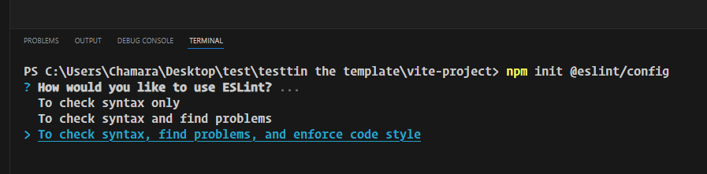
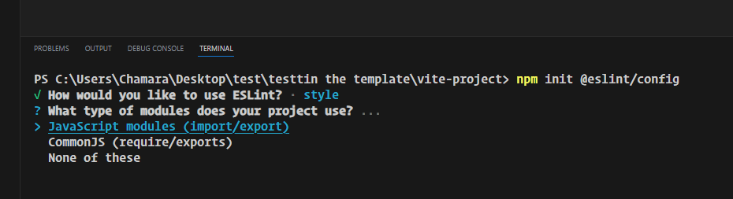
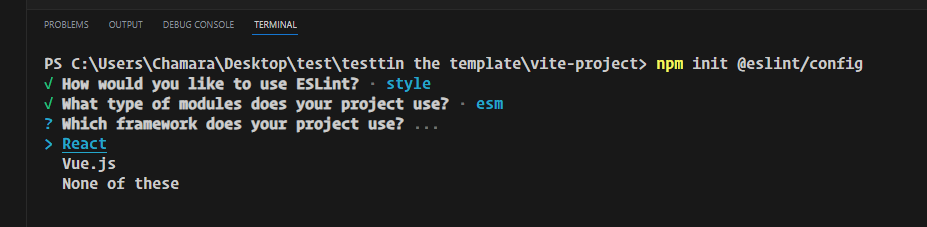
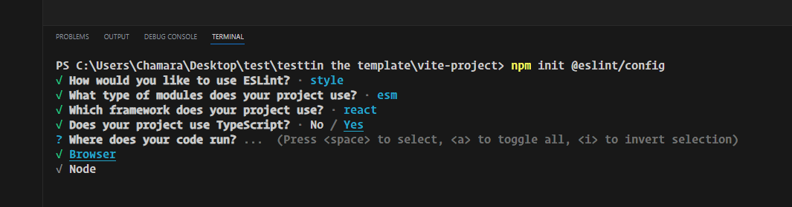
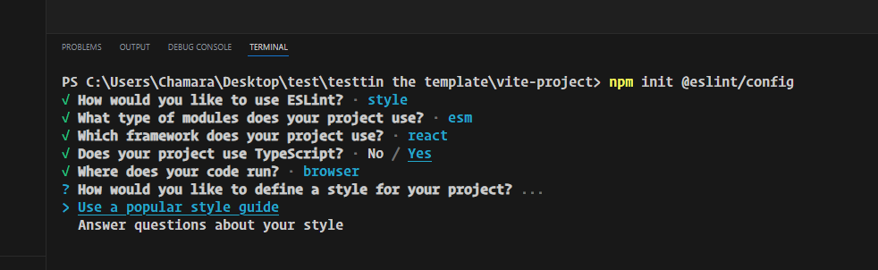
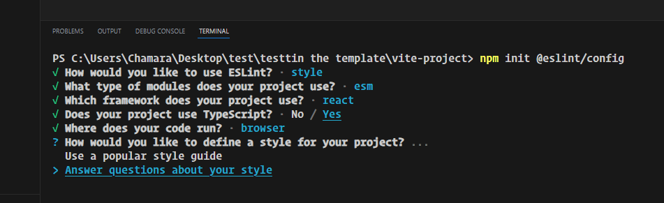
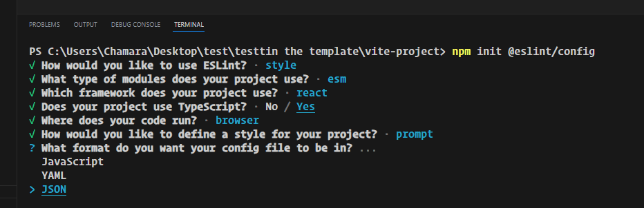
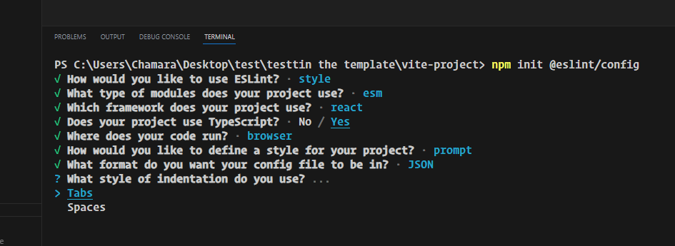
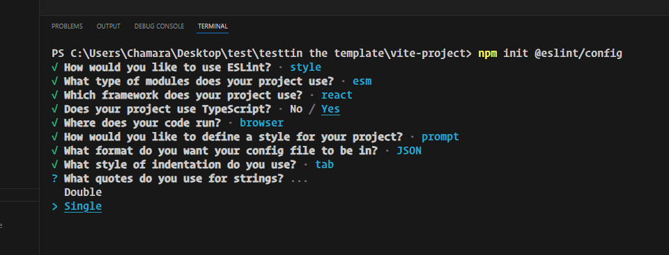
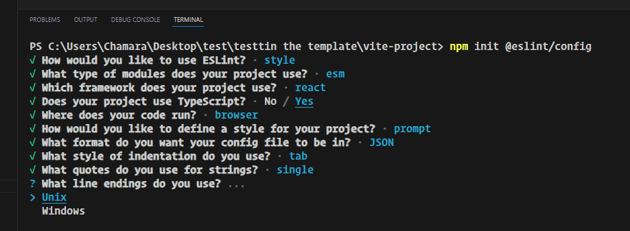
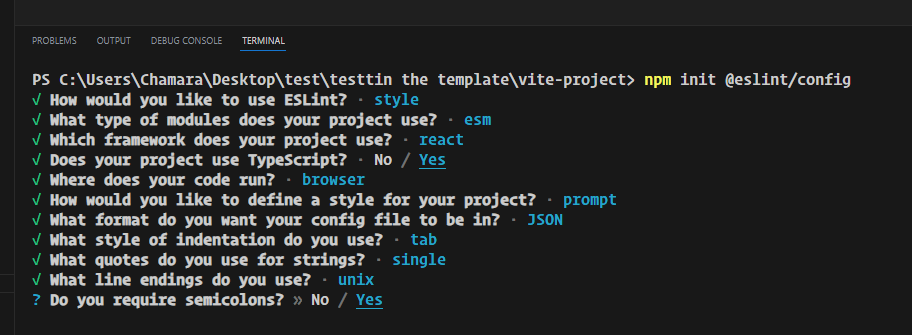
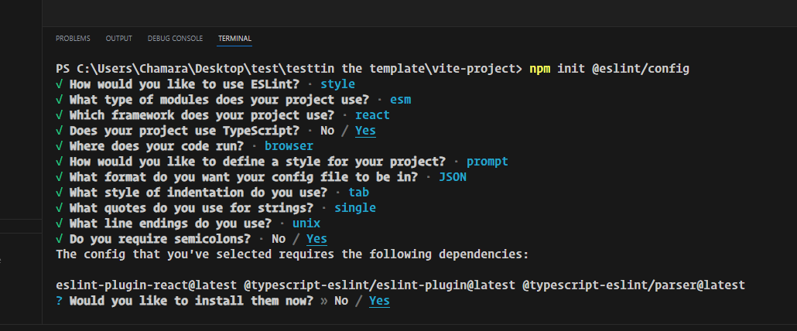
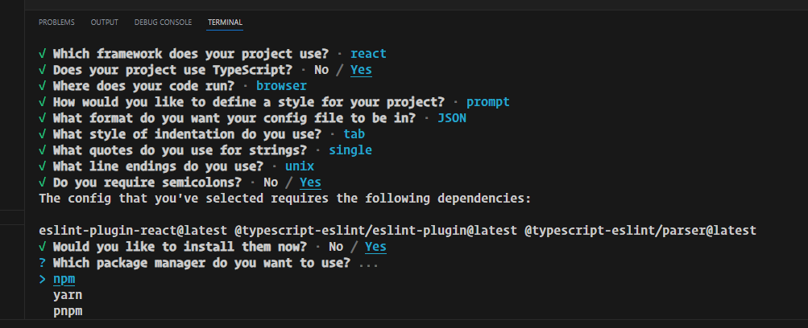
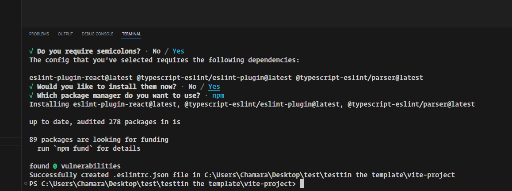

these dependencies are needed for the application.

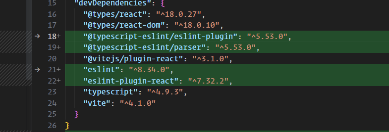

```bash
npm i -D @typescript-eslint/eslint-plugin @typescript-eslint/parser eslint eslint-plugin-react
```

this will generate the eslint config file

```json
{
  "env": {
    "browser": true,
    "es2021": true
  },
  "extends": [
    "eslint:recommended",
    "plugin:react/recommended",
    "plugin:@typescript-eslint/recommended"
  ],
  "overrides": [
  ],
  "parser": "@typescript-eslint/parser",
  "parserOptions": {
    "ecmaVersion": "latest",
    "sourceType": "module"
  },
  "plugins": [
    "react",
    "@typescript-eslint"
  ],
  "rules": {
    "indent": [
      "error",
      "tab"
    ],
    "linebreak-style": [
      "error",
      "unix"
    ],
    "quotes": [
      "error",
      "single"
    ],
    "semi": [
      "error",
      "always"
    ]
  }
}

```

now our application looks like this.


since we are using react 18 we do not need to add react to every component

so we will use this extension

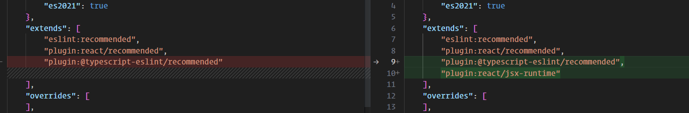

this will remove the React error.

to fix those issues we will run the linter \

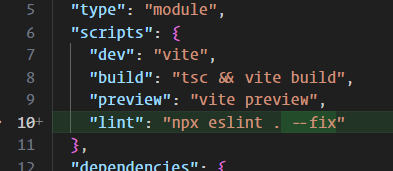

let's run this command

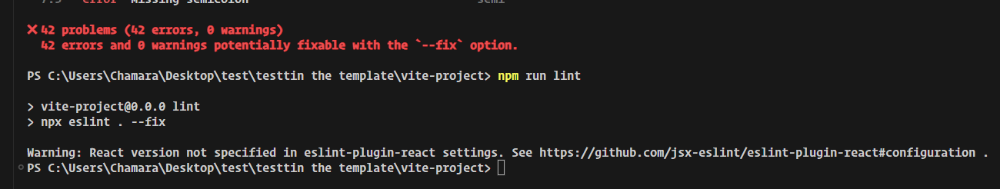

now we can see the result

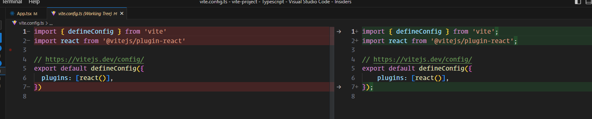
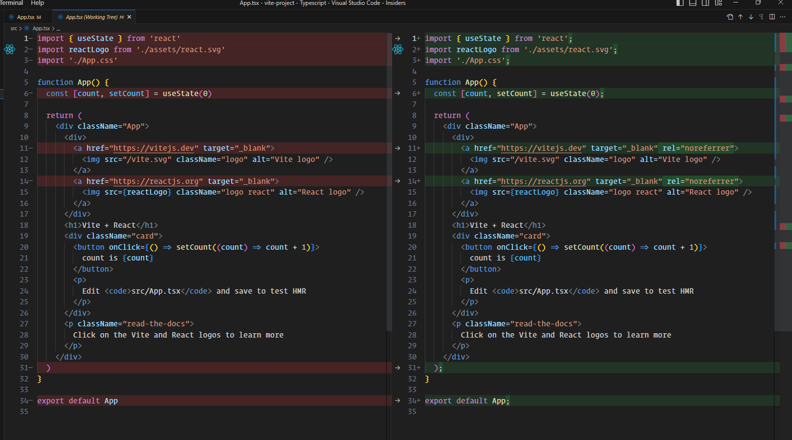
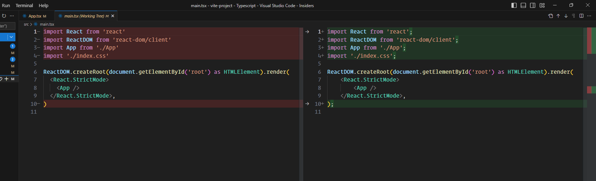

since we are using react hooks let's add linting rules for then as well.

```bash
npm install eslint-plugin-react-hooks --save-dev
```

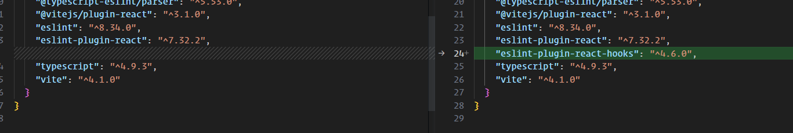

and this to extend.

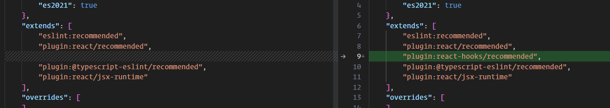

now let's add prettier

```bash
npm install --save-dev --save-exact prettier
```

then

```bash
echo {}> .prettierrc.json
echo {}> ..prettierignore
```

ESLint (and other linters)

If you use ESLint, install eslint-config-prettier to make ESLint and Prettier play nice with each other. It turns off
all ESLint rules that are unnecessary or might conflict with Prettier.

let's add `eslint-config-prettier`

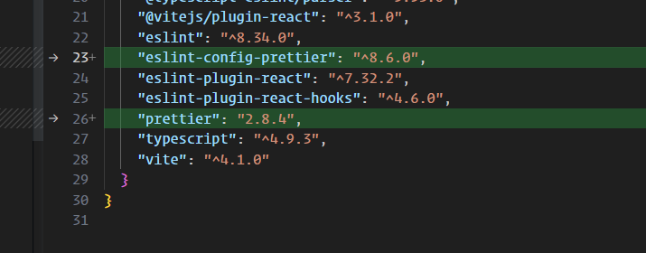

if you are using vscode

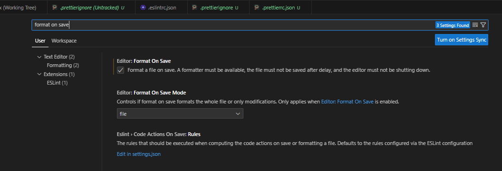

add the config

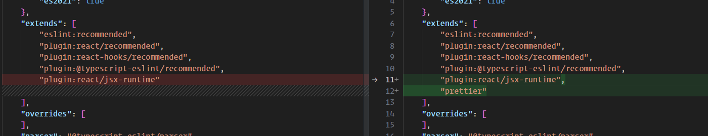

this sis the config

```json

{
  "arrowParens": "always",
  "singleQuote": true
}
```

let's integrate prettier to the eslint.

we will use `eslint-plugin-prettier `

Runs Prettier as an ESLint rule and reports differences as individual ESLint issues.

```bash
npm install --save-dev eslint-plugin-prettier
```

package updated

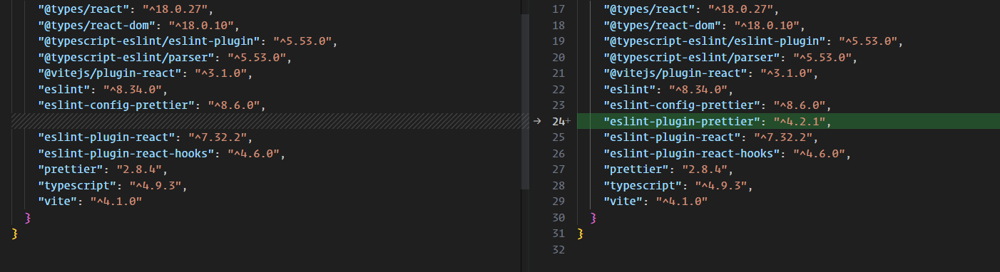

adding prettier rules

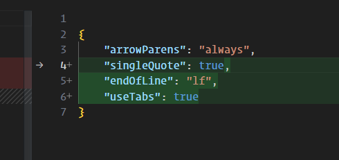

adding prettier config

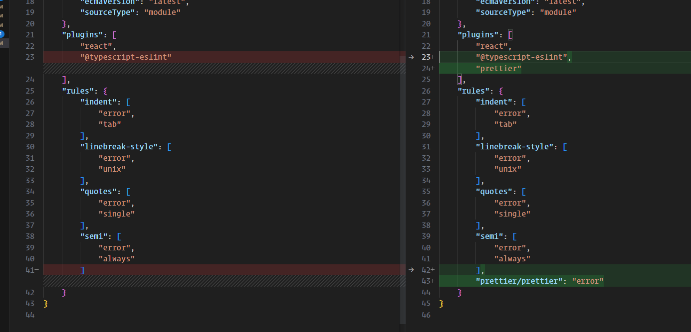

```json
{
  "env": {
    // browser means this app will run on the browser
    "browser": true,
    // this is the target js version
    "es2021": true
  },
  "extends": [
    // using the plugins we import in the plugins section
    "eslint:recommended",
    // this will add the recommended rules from the react plugin
    "plugin:react/recommended",
    // this will add the recommended rules from the react-hooks plugin
    "plugin:react-hooks/recommended",
    // this will add the recommended rules from the @typescript-eslint
    "plugin:@typescript-eslint/recommended",
    // add the prettier recommended setting
    "plugin:prettier/recommended",
    // so we don't have to import react in every component
    "plugin:react/jsx-runtime"
  ],
  "overrides": [],
  // this is used to parse typescript
  "parser": "@typescript-eslint/parser",
  // these are the options for the parsing
  "parserOptions": {
    "ecmaVersion": "latest",
    "sourceType": "module"
  },
  // these are the plugins we installed on our application.
  // @typescript-eslint -> @typescript-eslint/eslint-plugin
  // promise -> "eslint-plugin-promise": "^6.1.1",
  "plugins": [
    "react",
    "@typescript-eslint",
    "promise"
  ],
  "rules": {
    "prettier/prettier": [
      "error",
      {
        "singleQuote": true,
        "endOfLine": "lf",
        "semi": true,
        "useTabs": true,
        "bracketSpacing": true,
        "bracketSameLine": true
      }
    ]
    // this will throw an error when we use tabs for indentation.
    // use lf for the line break will fix the crlf files when we run the linter
    "linebreak-style": [
      "error",
      "unix"
    ],
    /* this is related to promise" */
    "promise/always-return": "error",
    "promise/no-return-wrap": "error",
    "promise/param-names": "error",
    "promise/catch-or-return": "error",
    "promise/no-native": "off",
    "promise/no-nesting": "warn",
    "promise/no-promise-in-callback": "warn",
    "promise/no-callback-in-promise": "warn",
    "promise/avoid-new": "warn",
    "promise/no-new-statics": "error",
    "promise/no-return-in-finally": "warn",
    "promise/valid-params": "warn"
  },
  "settings": {
    // these are related to react eslint plugin
    "react": {
      "version": "18.2.0"
    }
  }
}

```

## eslint config dependencies

### [eslint-config-prettier](https://github.com/prettier/eslint-config-prettier/)

Turns off all rules that are unnecessary or might conflict with Prettier.

### [eslint-plugin-react](https://www.npmjs.com/package/eslint-plugin-react)

React specific linting rules for eslint


<!-- not completed -->

## Adding lint-staged to lint our staged files.

first install

```bash
npm install --save-dev lint-staged
```

then create a config file. `.lintstagedrc.json`

```json
{
  "src/**/*.{ts,tsx}": "npm run lint",
  "src/**/*.{html,scss,css}": "prettier --write",
  "*.json": "prettier --write"
}
```

## Husky setup

```bash
npx husky-init && npm install
```

It will set up husky, modify package.json and create a sample pre-commit hook that you can edit. By default, it will run
npm test when you commit.
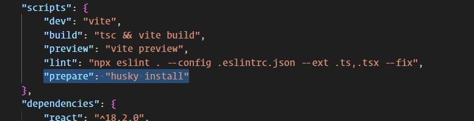

let's add our lint staged command to our pre commit hook.

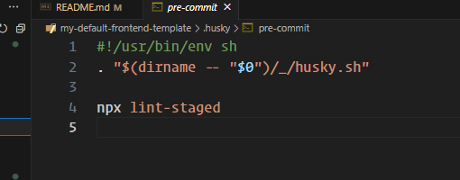

to add new hooks

```bash
npx husky add .husky/commit-msg 'npx --no -- commitlint --edit "$1"'
```

let's add commit lint to check our commit message.

let's install the dependencies.

```bash 
npm i -D @commitlint/cli @commitlint/config-conventional
```

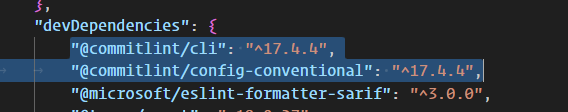

let's add the configuration file to the commitlintrc.json

```json
{
  "extends": [
    "@commitlint/config-conventional"
  ],
  "rules": {
    "header-max-length": [
      2,
      "always",
      50
    ]
  }
}
```

let's add this to our commit message hook
to add new hooks

```bash
npx husky add .husky/commit-msg 'npx --no -- commitlint --edit "$1"'
```

and change it to `prepare-commit-msg`

```sh
#!/usr/bin/env sh
. "$(dirname -- "$0")/_/husky.sh"

npx --no -- commitlint --edit $1 --color
```

let's add a protected branch as well.

```bash
npx husky add .husky/commit-msg 'npx --no -- commitlint --edit "$1"'
```

add this code

```json
#!/usr/bin/env sh
. "$(dirname -- "$0")/_/husky.sh"

BRANCH=$(git rev-parse --abbrev-ref HEAD)

if ["$BRANCH" = "main"]; then
echo "You are not allowed to commit changes directly to the development branch"
exit 1
fi
```

## Adding Redux Toolkit

### Installation

since we are using it with react

```shell
npm install @reduxjs/toolkit react-redux
```

and types for the React-redux library

```shell
npm i -D @types/react-redux
```


### let's create a simple counter slice.

```ts
import { createSlice, PayloadAction } from '@reduxjs/toolkit';

interface CounterState {
	value: number;
}

const initialState: CounterState = {
	value: 0,
};

const counterSlice = createSlice({
	name: 'counter',
	initialState,
	reducers: {
		increment(state) {
			state.value++;
		},
		decrement(state) {
			state.value--;
		},
		amountAdded(state, action: PayloadAction<number>) {
			state.value += action.payload;
		},
	},
});

export const { decrement, increment, amountAdded } = counterSlice.actions;

export default counterSlice.reducer;
```

we are importing createSlice which is the abstraction layer to plain redux

adding interface to the state

and adding the initial state.

then we are creating the slice.

1. inside we can add the initial state.
2. name of the slice
3. reducers

```ts
amountAdded(state, action
:
PayloadAction<number>
)
{
	state.value += action.payload;
}
,
```

here we have access to the local state and action.

from the slice we can export actions.

let's create another slice for the api slice

```ts
import { createApi, fetchBaseQuery } from '@reduxjs/toolkit/query/react';

const API_KEY =
	'live_kicdDGwE77g052Gkl9558mF31sFJpJhwlG6nUzbXsclXPPO3zDwCH7OKmVPXIy3Z';

interface Breed {
	id: string;
	name: string;
	image: {
		url: string;
	};
}

export const apiSlice = createApi({
	reducerPath: 'api',
	baseQuery: fetchBaseQuery({
		baseUrl: 'https://api.thedogapi.com/v1',
		prepareHeaders(headers) {
			headers.set('x-api-key', API_KEY);
			return headers;
		},
	}),
	endpoints(builder) {
		return {
			fetchBreed: builder.query<Breed[], number | void>({
				query(limit = 10) {
					return `/breeds?limit=${limit}`;
				},
			}),
		};
	},
});

export const { useFetchBreedQuery } = apiSlice;

```

### let's create the store

```ts
import { configureStore } from '@reduxjs/toolkit';
import counterReducer from '../features/counter/counter.slice';
import { apiSlice } from '../features/dogs-api/dogs.api.slice';

export const store = configureStore({
	reducer: {
		counter: counterReducer,
		[apiSlice.reducerPath]: apiSlice.reducer,
	},
	middleware: (getDefaultMiddleware) => {
		return getDefaultMiddleware().concat(apiSlice.middleware);
	},
});

export type AppDispatch = typeof store.dispatch;
export type RootState = ReturnType<typeof store.getState>;
```

### let's create the hooks to get the types

```ts
import { TypedUseSelectorHook, useDispatch, useSelector } from 'react-redux';
import { AppDispatch, RootState } from './store';

export const useAppDispatch = () => useDispatch<AppDispatch>();

export const useAppSelector: TypedUseSelectorHook<RootState> = useSelector;

```

### let's add the Provider

```tsx
import React from 'react';
import ReactDOM from 'react-dom/client';
import App from './App';
import './index.css';
import { Provider } from 'react-redux';
import { store } from './app/store';

ReactDOM.createRoot(document.getElementById('root') as HTMLElement).render(
	<Provider store={store}>
		<React.StrictMode>
			<App />
		</React.StrictMode>
	</Provider>
);
```

### let's use the api

```tsx
import { useState } from 'react';
import './App.css';
import { useFetchBreedQuery } from './features/dogs-api/dogs.api.slice';

function App() {
	const [selectedValue, setSelectedValue] = useState<number>(10);
	const { isFetching, data = [] } = useFetchBreedQuery(selectedValue);

	return (
		<div className="App">
			{isFetching && <div>Loading</div>}
			<div>
				<p>Number os Dogs fetched: {data.length}</p>
			</div>
			<div>
				<select
					value={selectedValue}
					onChange={(e) => setSelectedValue(+e.target.value)}>
					<option value="5">5</option>
					<option value="10">10</option>
					<option value="20">20</option>
					<option value="30">30</option>
				</select>
			</div>
			<table>
				<thead>
				<tr>
					<td>id</td>
					<td>name</td>
					<td>image</td>
				</tr>
				</thead>
				<tbody>
				{data.map((dog) => (
					<tr key={dog.id}>
						<td>{dog.id}</td>
						<td>{dog.name}</td>
						<td>
							
						</td>
					</tr>
				))}
				</tbody>
			</table>
			{/* <h1>value</h1>
			<h1>{value}</h1>
			<button onClick={() => dispatch(amountAdded(12))}>increment</button> */}
		</div>
	);
}

export default App;

```

## adding the test framework

### installing vtest

```bash
npm i -D vitest
```

now we can see the package.json file is updated.

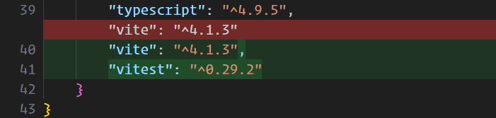

let's update the vite.config.ts file to setup our test environment.

```ts
/// <reference types="vitest"/>
import { defineConfig } from 'vite'

export default defineConfig({
	test: {
		// ...
	},
})
```

we are adding the rest key to the config file to setup the test configuration.

You'll also need to add a reference to Vitest types using a triple slash command at the top of your config file, if you
are importing defineConfig from vite itself.

[`globals:true`](https://vitest.dev/config/#globals) is used to add the test functions globally available in the
browser.

let's add files which will be included as test files

```ts
/// <reference types="vitest"/>

import { defineConfig } from 'vite';
// import { configDefaults } from 'vitest/config';

import react from '@vitejs/plugin-react';

// https://vitejs.dev/config/
export default defineConfig({
	plugins: [react()],
	test: {
		include: ['**/*.{test,spec}.{js,mjs,cjs,ts,mts,cts,jsx,tsx}'],
	},
});

```

let's add files which fill be excluded from testing

```ts
/// <reference types="vitest"/>

import { defineConfig } from 'vite';
// import { configDefaults } from 'vitest/config';

import react from '@vitejs/plugin-react';

// https://vitejs.dev/config/
export default defineConfig({
	plugins: [react()],
	test: {
		include: ['**/*.{test,spec}.{js,mjs,cjs,ts,mts,cts,jsx,tsx}'],
		exclude: [
			'**/node_modules/**',
			'**/dist/**',
			'**/cypress/**',
			'**/.{idea,git,cache,output,temp}/**',
			'**/{karma,rollup,webpack,vite,vitest,jest,ava,babel,nyc,cypress,tsup,build}.config.*',
		],
	},
});

```

since our application is a web application we will use jsdom as a environment.

```ts
/// <reference types="vitest"/>

import { defineConfig } from 'vite';
// import { configDefaults } from 'vitest/config';

import react from '@vitejs/plugin-react';

// https://vitejs.dev/config/
export default defineConfig({
	plugins: [react()],
	test: {
		include: ['**/*.{test,spec}.{js,mjs,cjs,ts,mts,cts,jsx,tsx}'],
		exclude: [
			'**/node_modules/**',
			'**/dist/**',
			'**/cypress/**',
			'**/.{idea,git,cache,output,temp}/**',
			'**/{karma,rollup,webpack,vite,vitest,jest,ava,babel,nyc,cypress,tsup,build}.config.*',
		],
		environment: 'jsdom',
	},
});
```

let's add the test command

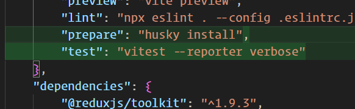

and install the jsdom since our env is web application.

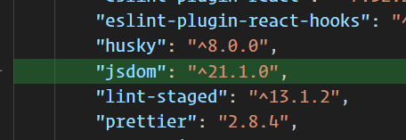

let's write a test command to check the jsdom implementation

```ts
import { test, expect } from 'vitest';

test('use jsdom in this test file', () => {
	const element = document.createElement('div');
	expect(element).not.toBeNull();
});

```

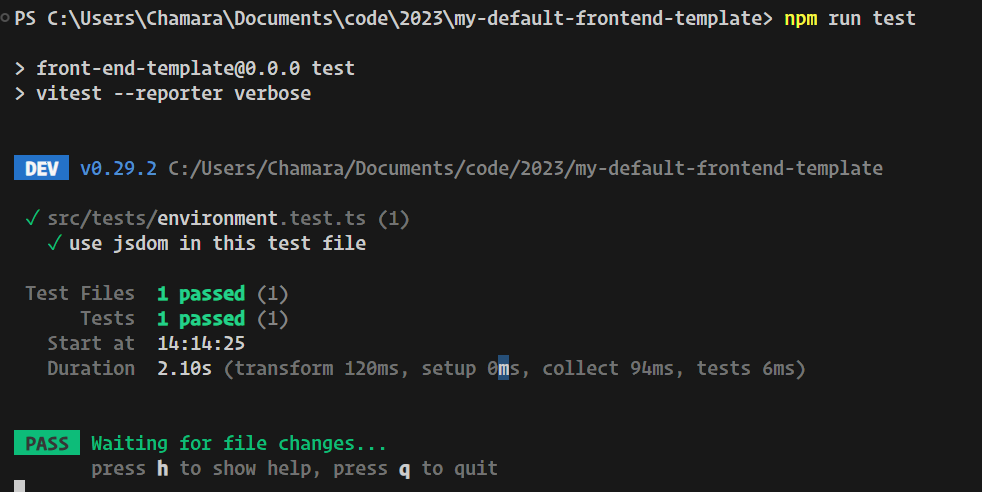

let'a add coverage configuration

```ts
/// <reference types="vitest"/>

import { defineConfig } from 'vite';
// import { configDefaults } from 'vitest/config';

import react from '@vitejs/plugin-react';

// https://vitejs.dev/config/
export default defineConfig({
	plugins: [react()],
	test: {
		include: ['**/*.{test,spec}.{js,mjs,cjs,ts,mts,cts,jsx,tsx}'],
		exclude: [
			'**/node_modules/**',
			'**/dist/**',
			'**/cypress/**',
			'**/.{idea,git,cache,output,temp}/**',
			'**/{karma,rollup,webpack,vite,vitest,jest,ava,babel,nyc,cypress,tsup,build}.config.*',
		],
		environment: 'jsdom',
		coverage: {
			provider: 'c8',
			extension: ['.ts', '.tsx'],
			all: true,
			// include: ['**/src/features/**'],
			branches: 50,
			statements: 50,
			functions: 50,
			lines: 50,
		},
	},
});

```

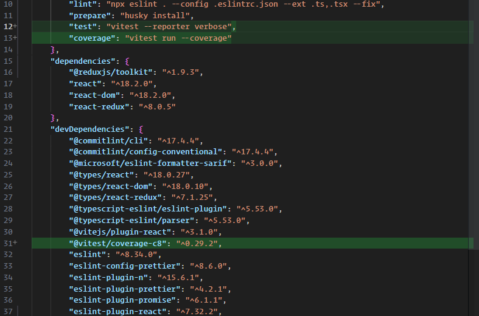

add the coverage folder to the gitignore

```.gitignore
image.png
```

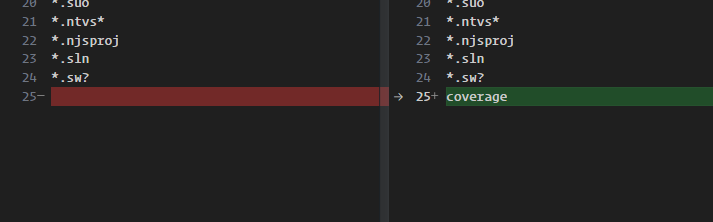

let's add jest dom matchers to the application

```bash
npm i -D @testing-library/jest-dom
```

let's create a file called `setup.Tests.ts`

```ts
import matchers from '@testing-library/jest-dom/matchers';
import { expect } from 'vitest';

expect.extend(matchers);
```

then we will add the setup file path to the define config object

```ts
setupFiles: './src/setupTests.ts',
```

now we will have access to dom specific matchers.

## React Router

### let's install react router dom

```shell
npm i react-router-dom
```

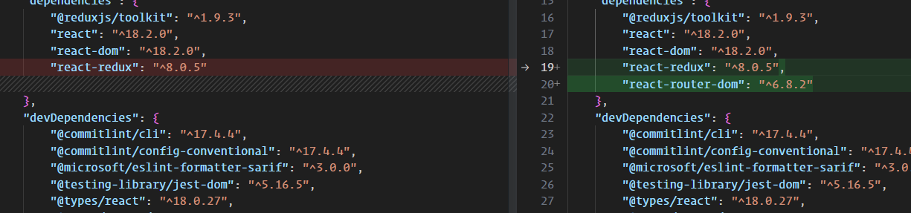

let's install the testing libraries to test the react application

```shell
npm i -D @testing-library/react @testing-library/user-event
```

let's add the vite config file to the tsconfig file.

```json
"include": ["src", "vite.config.ts"],
```

let's add the vite client types to the application

```ts
/// <reference types="vite/client"/>
```

let's add the setup file to the config file

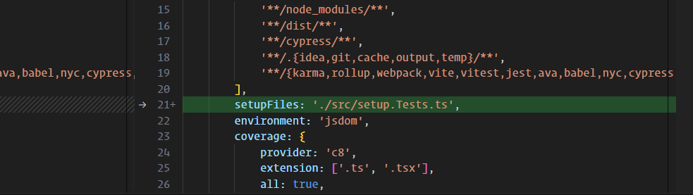

let's create some sample pages

About page

```tsx
import { FC } from 'react';

const AboutPage: FC = () => {
	return <h1>About Page</h1>;
};

export default AboutPage;

```

Home page

```tsx
import { FC } from 'react';

const HomePage: FC = () => {
	return (
		<>
			<h1>Home Page</h1>
		</>
	);
};

export default HomePage;

```

Login page

```tsx
import { FC } from 'react';

const LoginPage: FC = () => {
	return <h1>Login Page</h1>;
};

export default LoginPage;
```

Not Found page

```tsx
import { FC } from 'react';
import { Link } from 'react-router-dom';

const NotFoundPage: FC = () => {
	return (
		<>
			<h1>NOT FOUND</h1>
			<div>
				<Link to={'/home'}>Back To Home Page</Link>
			</div>
		</>
	);
};

export default NotFoundPage;
```

Header Component

```tsx
import { FC } from 'react';
import { Link } from 'react-router-dom';

const Header: FC = () => {
	return (
		<ul>
			<li>
				<Link to={'/home'}>Home</Link>
			</li>
			<li>
				<Link to={'/about'}>About</Link>
			</li>
			<li>
				<Link to={'/login'}>Login</Link>
			</li>
		</ul>
	);
};

export default Header;
```

App Component

```tsx
import { Outlet } from 'react-router-dom';
import './App.css';
import Header from './Components/Header/Header.component';

function App() {
	return (
		<div className="app">
			<Header />
			<Outlet />
		</div>
	);
}

export default App;

```

let's setup the main page
main

```tsx
import React from 'react';
import ReactDOM from 'react-dom/client';
import App from './App';
import './index.css';
import { Provider } from 'react-redux';
import { store } from './app/store';

import { createBrowserRouter, RouterProvider } from 'react-router-dom';
import HomePage from './pages/Home/Home.page';
import NotFound from './pages/NotFound/NotFound.page';
import AboutPage from './pages/About/About.page';
import LoginPage from './pages/Login/Login.page';

export const CustomRouter = createBrowserRouter([
	{
		path: '/',
		element: <App />,
		children: [
			{
				path: '/home',
				element: <HomePage />,
			},
			{
				path: '/about',
				element: <AboutPage />,
			},
			{
				path: '/login',
				element: <LoginPage />,
			},
		],
	},

	{
		path: '/*',
		element: <NotFound />,
	},
]);

ReactDOM.createRoot(document.getElementById('root') as HTMLElement).render(
	<Provider store={store}>
		<React.StrictMode>
			<RouterProvider router={CustomRouter} />
		</React.StrictMode>
	</Provider>
);

```

let's write the test cases for the app routes
About page

```tsx
import { render, screen } from '@testing-library/react';
import { describe, expect, it } from 'vitest';
import { MemoryRouter, Route, Routes } from 'react-router-dom';
import userEvent from '@testing-library/user-event';
import App from '../App';
import HomePage from '../pages/Home/Home.page';
import AboutPage from '../pages/About/About.page';
import LoginPage from '../pages/Login/Login.page';
import NotFoundPage from '../pages/NotFound/NotFound.page';

describe('App', () => {
	it('landing on a bad page', async () => {
		const badRoute = '/12w12312';

		// use <MemoryRouter> when you want to manually control the history
		render(
			<MemoryRouter initialEntries={[badRoute]}>
				<Routes>
					<Route path="/" element={<App />}>
						<Route path="/home" element={<HomePage />} />
						<Route path="/about/*" element={<AboutPage />} />
						<Route path="/login/*" element={<LoginPage />} />
						<Route path="/*" element={<NotFoundPage />} />
					</Route>
				</Routes>
			</MemoryRouter>
		);

		// verify navigation to "no match" route
		expect(screen.getByText(/NOT FOUND/i)).toBeInTheDocument();

		const user = userEvent.setup();

		// verify page content for expected route after navigating
		await user.click(
			screen.getByRole('link', {
				name: 'About',
			})
		);
		expect(screen.getByText(/About Page/i)).toBeInTheDocument();

		await user.click(
			screen.getByRole('link', {
				name: 'Login',
			})
		);
		expect(screen.getByText(/Login Page/i)).toBeInTheDocument();

		await user.click(
			screen.getByRole('link', {
				name: 'Home',
			})
		);
		expect(screen.getByText(/Home Page/i)).toBeInTheDocument();
	});
});

```

## adding tailwind css to the application

[how to add tailwind css](https://tailwindcss.com/docs/guides/vite)